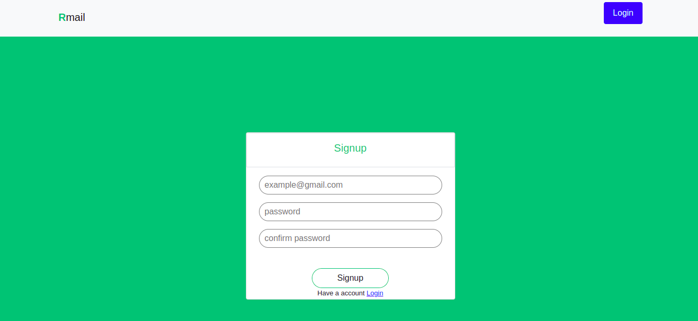
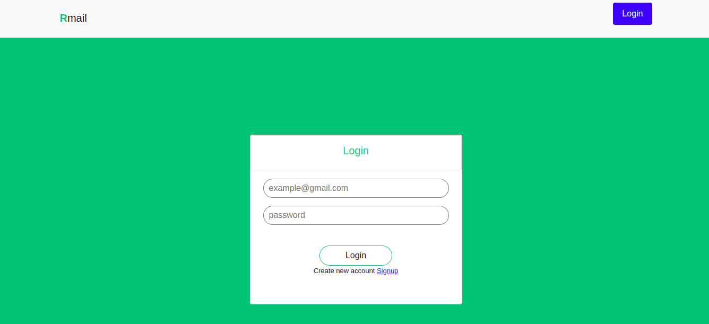
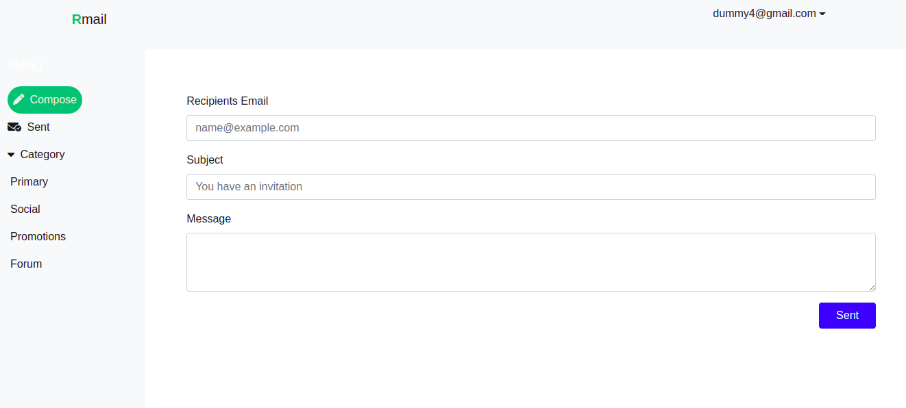
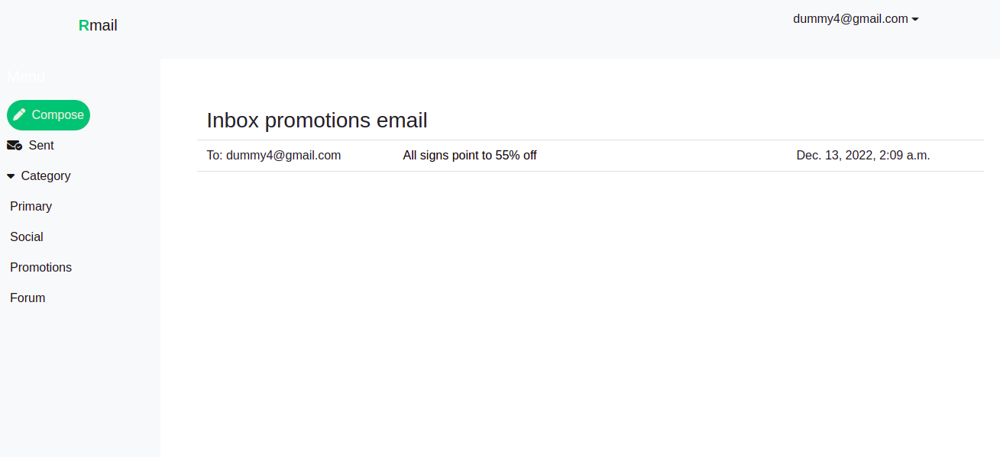
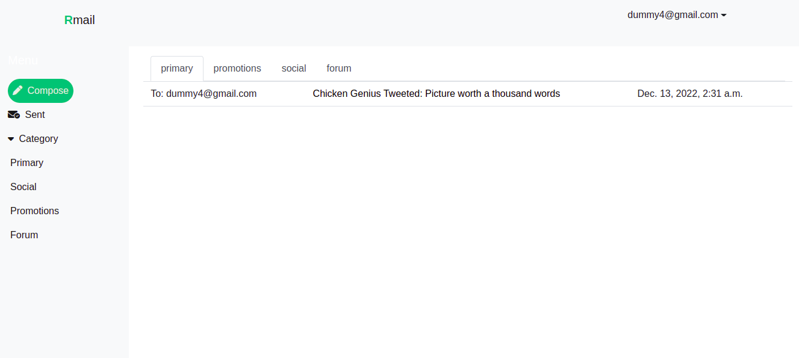

# Create an email platform by using Django

## Deployment url
https://munazer.pythonanywhere.com/login

## LOCAL SETUP
   ** Create virtual environment(python3 -m venv venv) 
      and install all dependencies which is exist in requirment.txt 
      by "pip / pip3 install -r requirements.txt. 
      Then run the project in your local machine by 
      "python / python3 manage.py runserver" 
      and visit http://localhost:8000/.

# Features

## Signup
This is the signup page. Users can signup by using email
and password. The email address must be unique.

## Login
This is login page. Users can login by using email and password.

## Email Create
In this page users give recipients email, subject and message to
send email. Users can not send email to unauthorized email and also
his own email.

## Email Category
On this page, users can see the email list by Category wise. 

## Home page
This is the home page. Users can see inbox email with all category.

